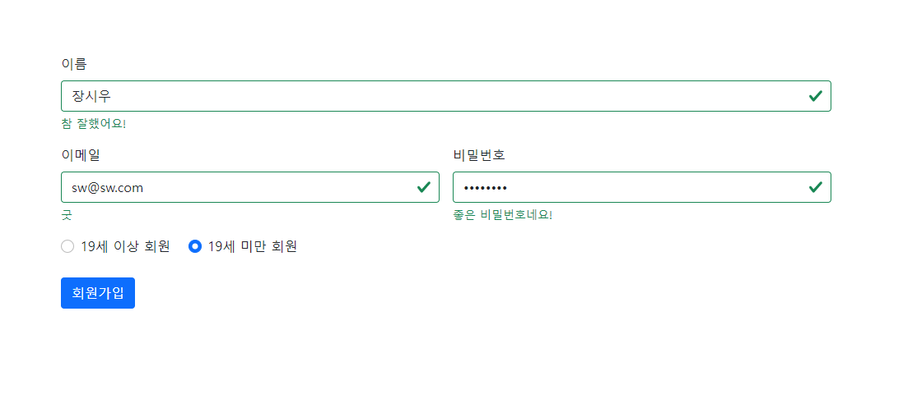
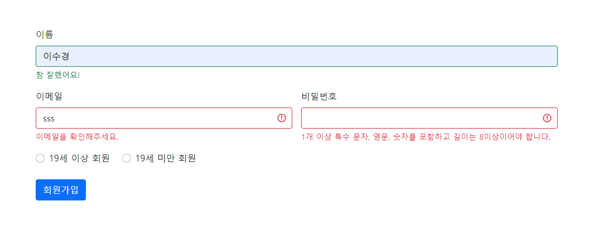

# WhereIsMyHome_3_FrondEnd_5조_이수경_장시우

> ## 기본 기능
> ### 주택 거래 데이터 분석
>	  1) 아파트/주택 매매/전,월세 거래 정보에 대해 법정동 또는 아파트 이름으로 검색
>	  2) 검색된 아파트/주택에 대해 상세 정보를 확인
  

## 목차
> ###  1. [메인페이지 및 메뉴 구성](#1-메인페이지-및-메뉴-구성)
> ###  2. [실거래가 조회 결과](#2-실거래가-조회-결과-페이지)
> ###  3. [회원관리](#3-회원관리-페이지)
> ###  4. [로그인/로그아웃 ](#4-로그인로그아웃-페이지)
> ###  5. [관심지역 동네업종 정보 조회](#5-관심지역-동네업종-정보-조회)
> ###  6. [관심지역 대기오염 정보 조회](#6-관심지역-대기오염-정보-조회)
  

> # 1. 메인페이지 및 메뉴 구성
> 

  
> # 2. 실거래가 조회, 결과 페이지
> 실거래가 조회 메인 페이지
> 
> ###  동별 검색 
> 
> ### 아파트별 검색
>    
> ## 공통 코드
> 회원 가입시 회원 코드 001인 사람만 병원 정보 조회 가능
> ### 병원 정보 조회
> 

  
> # 3. 회원관리 페이지
> ### 회원가입  
> 19세 이상 회원 등록
>   
> 19세 미만 회원 등록
>   
등록 완료 - 19세 이상 회원 코드 001, 19세 미만 회원 코드 002 
>    
회원가입 실패 시 
>   
회원가입 성공시 
>   
회원가입 완료 시 메인 페이지로 이동
> 

    
> ### 회원정보 수정 페이지
> 
>   
수정 완료 시  
>   
>    
탈퇴 완료 시  
> 

  
> # 4. 로그인/로그아웃 페이지
> 
>   
로그인 완료 
>   
로그아웃 완료 

   
# 5. 관심지역 동네업종 정보 조회

# 6. 관심지역 대기오염 정보 조회

